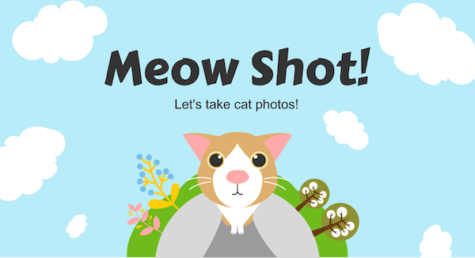
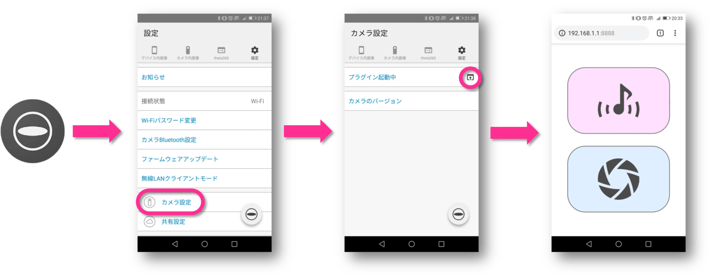

# Meow Shot!

猫ちゃん撮影を支援する THETA プラグイン ([English version is here](https://github.com/shrhdk/meowshot))

スマホから遠隔でシャッターを切る機能と、猫の鳴き声を再生する機能があります。
音声で猫ちゃんの気をひきつけて目線をもらいつつ、シャッターを切ります。
猫の鳴き声は THETA 本体のスピーカーから流れます。
スマホ側にアプリのインストールは不要です。ブラウザから操作します。

また、THETA 本体で音声を録音して再生する機能もあります。

## インストール方法

準備中

## 使い方

1. Meow Shot! プラグインが起動するように設定する → [取扱説明書](https://support.theta360.com/ja/manual/v/content/plugin/plugin_02.html)
2. THETA を Wi-Fi AP モードにしてスマホから接続する
3. モードボタンを長押ししてプラグインを起動する (本体 LED が白く光れば OK)
4. THETA アプリからプラグイン画面を開く

## 利用規約

* 本プラグインは本規約に同意した上でご利用ください。
* 大きな音が出る機能があります。周囲の環境に配慮してご利用ください。
* 本プラグインを利用することによってユーザーに生じた損害については、一切賠償しません
* 本プラグインは個人情報を収集しません。

## クレジット

* [NanoHTTPD](https://github.com/NanoHttpd/nanohttpd) Copyright (c) 2012-2013 by Paul S. Hawke, 2001,2005-2013 by Jarno Elonen, 2010 by Konstantinos Togias All rights reserved.
* [theta-plugin-sdk](https://github.com/theta4j/theta-plugin-sdk) Copyright 2018 theta4j project
* 猫の鳴き声データは [ポケットサウンド/効果音素材](https://pocket-se.info/) 様の [【効果音】猫の鳴き声＃１１](https://pocket-se.info/archives/81/) を利用しています。
* アイコンは [ICOOON MONO](http://icooon-mono.com/) 様の素材を利用しています。
