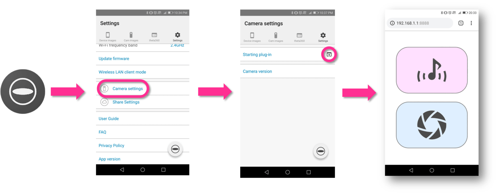

# meowshot

A THETA plug-in to support cat-shooting. ([日本語の説明はこちら](README.ja.md))

Get a cat's attension by a voice, and take a picture.

This plug-in has three commands.

* Take a 360&deg; picture remotely.
* Play a cute cat voice from a speaker in THETA remotely.
* Record your voice using a microphone in THETA and use it instead of cat voice.

You can execute these commands remotely using your smartphone.

You don't need to install a smartphone app. Just need a web browser.

## How to Install

In preparation.

## Usage

1. Set up to use "meowshot" plug-in. See [User Guide].(https://support.theta360.com/en/manual/v/content/plugin/plugin_02.html)
2. Connect the THETA to a smartphone via Wi-Fi.
3. Long press mode button to start the plug-in. (Success if LED is White.)
4. Open plug-in's Web UI from the THETA app.

## Terms of Use

* Please use this plug-in after agreeing to this agreement.
* This plug-in produces a loud sound. Please give consideration to the surrounding people.
* We will not compensate for damages caused to users by using this plug-in at all
* This plug-in does not collect personal information.

## Credits

* The cat voice data is  created by [ポケットサウンド/効果音素材](https://pocket-se.info/archives/81/).
* The app icons is created by [ICOOON MONO](http://icooon-mono.com/).
